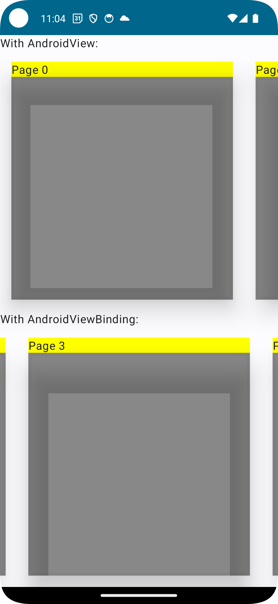

# Fragment within LazyRow issue

This repo demonstrates an issue with using a Fragment inside of a LazyRow in Jetpack Compose. The app consists of a LazyRow which for which each item is a Fragment. There is an example using AndroidView and an example using AndroidViewBinding.

In both cases the observed behaviour is that the fragments do not load correctly: when scrolling side to side we do not see any contents despite the fragments being initialised.

